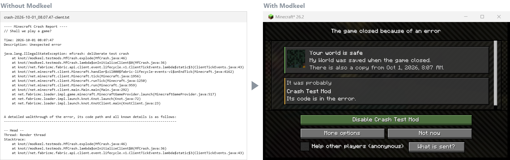
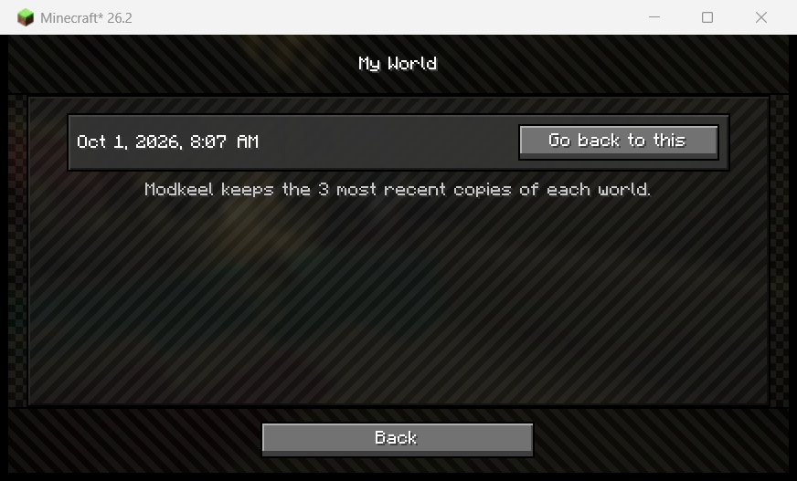
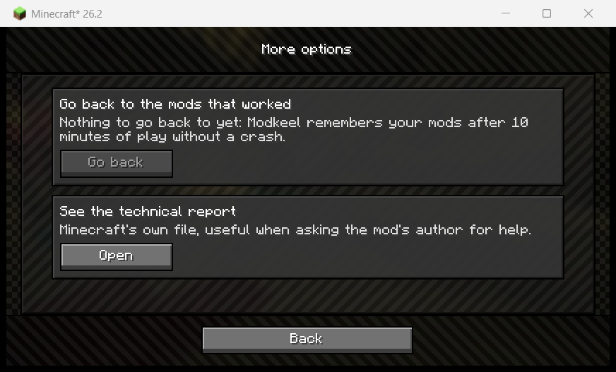
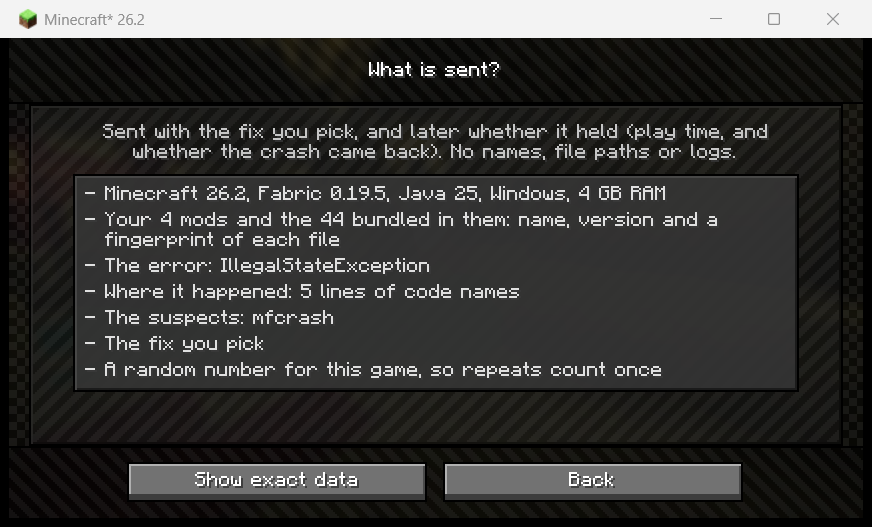
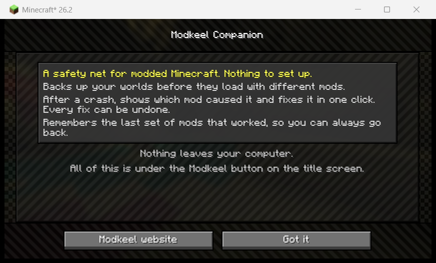
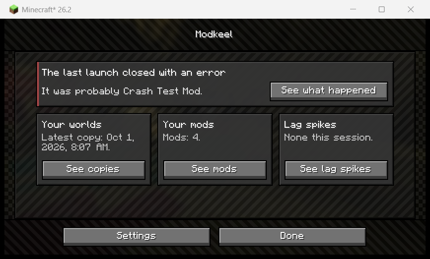
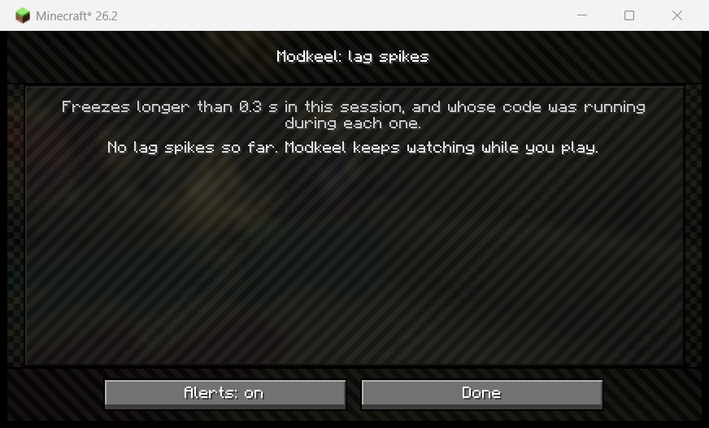

# Modkeel Companion

A safety net for modded Minecraft. Drop it in your mods folder; there is nothing to set up.



When the game crashes, the next start says which mod most likely did it, how sure Modkeel is and
why. One button disables that mod.

<table>
<tr>
<td width="33%" valign="top"><br>
<b>Your world is safe.</b> Before a world loads with different mods, Modkeel copies it. Going
back deletes nothing.</td>
<td width="33%" valign="top"><br>
<b>Every fix can be undone.</b> Or go back to the last set of mods that worked, and see whether
the fix held.</td>
<td width="33%" valign="top"><br>
<b>Sharing is your choice.</b> Nothing is sent unless you tick "Help other players", and you
see every field first.</td>
</tr>
</table>

<details>
<summary><b>More screens</b>: first start, the whole pack at a glance, lag spikes</summary>



The first start says what Modkeel does; everything else is under the Modkeel button on the
title screen.



One place for the whole pack: the last crash, world copies, your mods and what Modkeel knows
about them on this Minecraft version, and what it changed.



Freezes longer than 0.3 s, with whose code was running during each one, so a laggy mod has a
name.

</details>

**No mixins.** Modkeel does not patch the game, so it cannot be the reason a pack breaks.

> **Made with AI.** Modkeel's code, tests and texts are written with Claude (Anthropic's AI),
> directed by its developer, who decides what it does, reviews it and runs every release in real
> games on each loader before it ships. Releases are built in public and can be verified: see
> [Verify a release](#verify-a-release).

## Supported versions

| Minecraft | Fabric | NeoForge | Forge |
|-----------|--------|----------|-------|
| 26.x      | yes    |          |       |
| 1.21.11   | yes    |          |       |
| 1.21.1    | yes    | yes      |       |
| 1.20.1    | yes    |          | yes   |

Fabric needs [Fabric API](https://modrinth.com/mod/fabric-api).

## Languages

English, Spanish, Brazilian Portuguese, German, French, Russian and Simplified Chinese, with
regional variants (Spanish for Latin America, European Portuguese, Austrian and Swiss German,
Canadian French) using the closest one. Every text is in `game/resources/assets/modkeel/lang/`,
so a resource pack can add or override a language with its own `assets/modkeel/lang/<code>.json`.

## Building

No Gradle: `build.py` compiles with `javac` and remaps with
[tiny-remapper](https://github.com/FabricMC/tiny-remapper) on its own. It needs Python 3.10+ and
JDK 25 (set `MODKEEL_JDK` if it is not your `JAVA_HOME`).

```bash
python build.py                                # Fabric, Minecraft 26.2 (runs the core tests first)
python build.py --mc 1.21.1 --loader neoforge
python build.py --mc 1.20.1 --loader forge
python build.py --all                          # every released jar -> build/release/
```

Releases are on the [releases page](https://github.com/Modkeel/companion/releases).
NeoForge and Forge check `updates.json` in this repo and mark a newer Modkeel in their mods
list; the loader makes that request, not Modkeel. On Fabric, Mod Menu does the same through
Modrinth.

The first build of a version downloads the game, its mappings and the loader (for NeoForge and
Forge, through their official installers) into `~/.modkeel` (`MODKEEL_HOME`).

## Verify a release

Every jar on the releases page is built by GitHub Actions from the tagged source
([release.yml](.github/workflows/release.yml)), not on someone's computer. Three ways to check one:

1. **Checksum.** Each release lists `SHA256SUMS`: compare with `sha256sum <jar>`
   (Windows: `certutil -hashfile <jar> SHA256`).
2. **Provenance.** GitHub signs a record of which workflow, commit and tag built each jar:
   ```bash
   gh attestation verify modkeel-companion-0.2.0-fabric-26.jar -R Modkeel/companion
   ```
3. **Rebuild it yourself.** The build is reproducible: no file dates, one entry order, Unix
   line endings and pinned versions of the loaders, Fabric API and tools. With the JDK the
   workflow uses (Temurin 25.0.4.1+1) you get the same bytes:
   ```bash
   git checkout v0.2.0
   python build.py --all
   sha256sum build/release/*.jar     # same as SHA256SUMS
   ```
   Before a release goes public, the maintainer does exactly this and compares it with the
   GitHub build; if a single byte differs, the release is not published.

Each release's notes also link every jar's [VirusTotal](https://www.virustotal.com) report,
whatever it says. Java mods sometimes get a flag from one engine that is a false positive; the
report shows which engine and why, so you can judge for yourself.

## Layout

| Path | What |
|------|------|
| `core/` | Loader-agnostic logic: mod sets, world backups, crash diagnosis, fixes. Plain Java 17, with its own tests |
| `game/` | What only needs Minecraft: screens, backup and tick hooks, translations |
| `fabric/`, `neoforge/`, `forge/` | Thin entrypoints per loader |
| `forge-early/` | Forge only: a service that runs before Forge reads the mods, turns off a jar whose access transformer would close the game, and carries the mod inside |
| `*/versions/<v>/` | What changed between Minecraft versions |
| `testmods/` | Mods that crash on demand, for end-to-end tests |
| `build.py`, `remap.py`, `toolchain.py` | The build |

Sources use Mojang names. For versions before 26.1 they are remapped to intermediary (Fabric)
or SRG (Forge) names at build time.

## License

Code: MIT. See [LICENSE](LICENSE). More at [modkeel.com](https://modkeel.com).

Data: `game/resources/modkeel/rules.tsv`, the known problems Modkeel warns about (which mod
versions crash with which, found by running them in real games in our lab), is
[CC BY 4.0](LICENSE-DATA). Use it anywhere, credit "Modkeel lab data (modkeel.com)".
